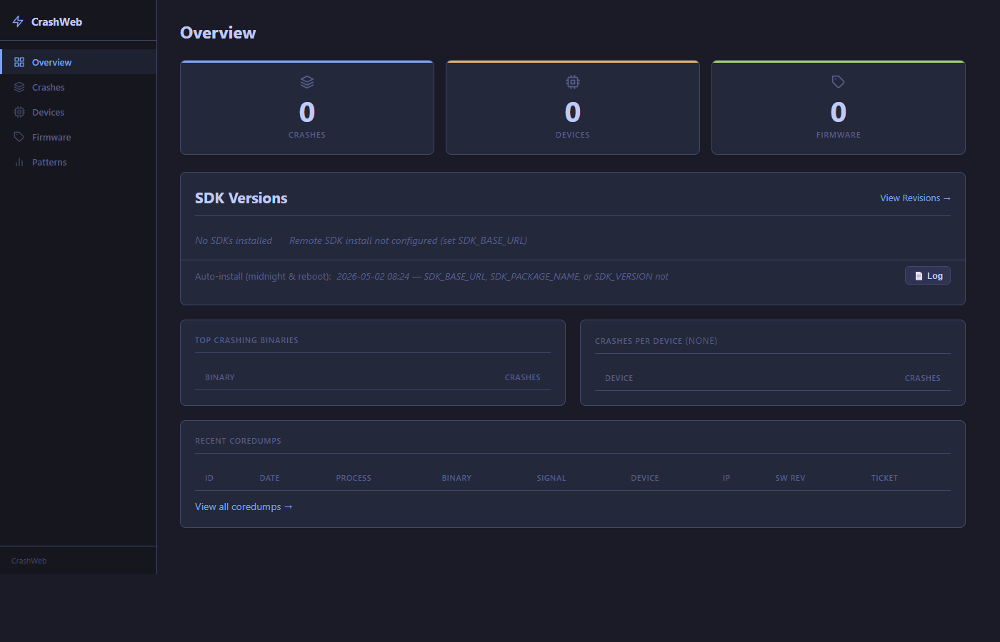
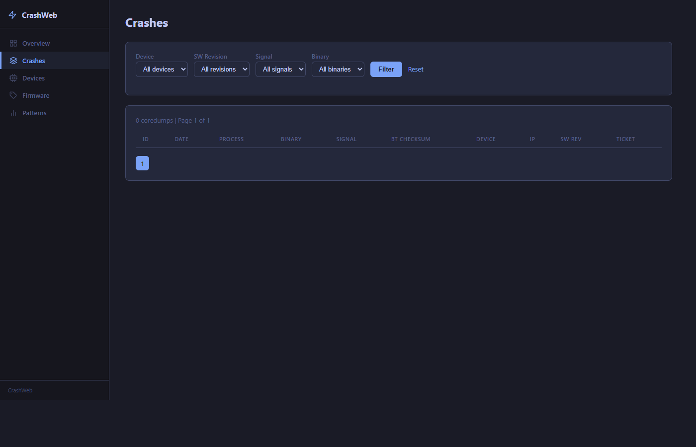
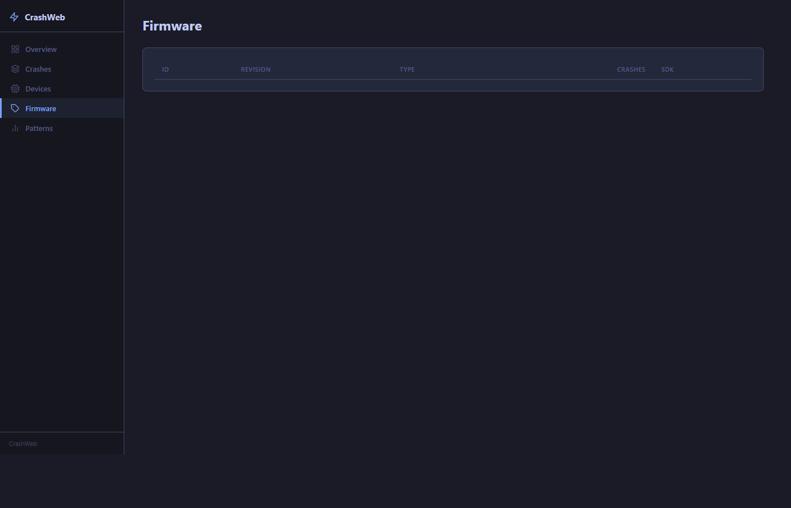
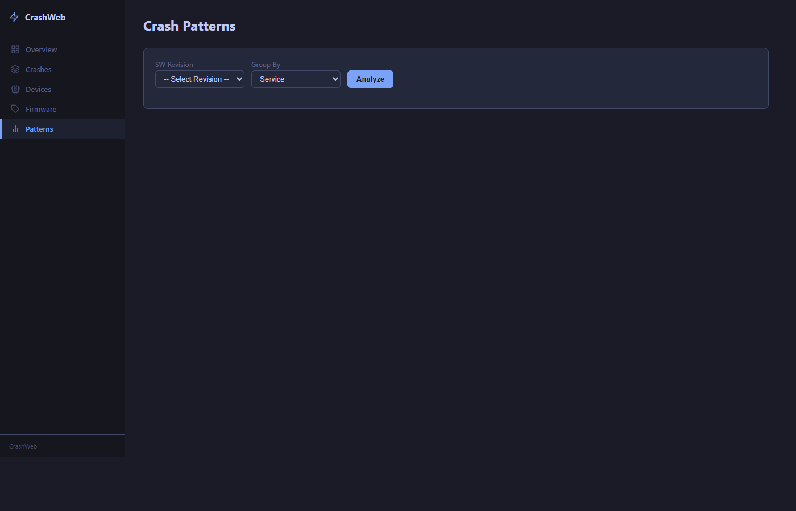

# CrashWeb

A self-hosted web UI for collecting, browsing, and analyzing coredumps from embedded Linux devices.



**Crashes** — filterable coredump list with signal badges and ticket tracking



**Firmware** — SDK install status per SW revision



**Patterns** — crash grouping by backtrace signature, systematic bug detection



## Features

| Page | URL | Description |
| ---- | --- | ----------- |
| Overview | `/` | Stats, top crashing binaries with cause classification, recent coredumps |
| Crashes | `/cores` | Filterable list by device, revision, signal, binary, backtrace checksum |
| Core detail | `/core/<id>` | Metadata, backtrace, journal, related crashes, ticket marking, GitHub issue creation |
| Devices | `/devices` | All known devices with crash counts |
| Device detail | `/device/<id>` | Per-device coredump list |
| Firmware | `/revisions` | All SW revisions with crash counts and SDK install status |
| Patterns | `/analyze` | Crash grouping by backtrace signature — systematic bug detection, cause badges |

Key capabilities:

- **Crash cause classification** — detects Watchdog Timeout, OOM Kill, Stack Smash, Bus Error, Segfault from journal lines
- **Systematic bug detection** — flags crash signatures seen on more than one device
- **Ticket / Mark-as-analyzed** — mark any crash signature with an issue number, propagated across all pages
- **Create GitHub Issue** — pre-fills title and backtrace in GitHub `issues/new` (requires `GITHUB_REPO`)
- **SDK management** — install SDKs per revision for backtrace generation (requires `SDK_BASE_URL`)
- **Coredump download** — direct download of `.core.gz` files with path traversal protection
- **Collector scripts** — SSH-based tools to pull coredumps from devices and upload them (see [`tools/`](#collector-tools))

## Stack

- **Flask** (Python 3) + gunicorn
- **MariaDB 10.6**
- **Traefik 3.6.7** (reverse proxy + TLS)
- **Docker Compose**

## Quick Start (local, no TLS)

```bash
# 1. Clone
git clone https://github.com/sberaconnects/crashweb
cd crashweb

# 2. Configure
cp .env.example .env
# Edit .env — at minimum set SECRET_KEY to a random string:
#   SECRET_KEY=$(openssl rand -hex 32)

# 3. Start (no Traefik — Flask on port 8080)
docker compose -f docker-compose.yml -f docker-compose-local.yml up -d mariadb flask-web ccs

# 4. Open http://localhost:8080
```

## Production Deployment

```bash
cp .env.example .env
# Fill in SECRET_KEY and any optional settings

# Edit traefik/traefik_dynamic-prod.yml:
#   - Replace YOUR_DOMAIN with your domain name
#   - Set certFile path to your TLS certificate

# Place SSL key at: ~/.ssh/crashweb.key

docker compose -f docker-compose.yml -f docker-compose-production.yml up -d --build
```

## Configuration

All settings via environment variables (or `.env` file). See `.env.example` for full list.

| Variable | Required | Description |
| -------- | -------- | ----------- |
| `SECRET_KEY` | Yes | Flask secret key — any long random string |
| `GITHUB_REPO` | No | `owner/repo` — enables "Create GitHub Issue" button |
| `SDK_BASE_URL` | No | Base URL for SDK downloads — enables remote SDK install |
| `SDK_PACKAGE_NAME` | No | SDK tarball name prefix (e.g. `my-device-sdk`) |
| `SDK_VERSION` | No | Version to auto-install on container start |
| `SDK_SYSROOT_SUBPATH` | No | Subdir inside SDK dir that marks install complete |
| `DB_HOST` | No | MariaDB host (default: `mariadb`) |
| `DB_USER` | No | DB user (default: `apache`) |
| `DB_PASSWORD` | No | DB password (default: empty) |
| `DB_NAME` | No | DB name (default: `coredumps`) |

## Device Setup

Devices send coredumps to the `ccs` service on port 5555. The collector service:

1. Receives the coredump file
2. Stores it to `COREDUMP_DIR` (`/home/coredumps` on the host)
3. Records metadata in MariaDB
4. Triggers backtrace generation (if SDK installed for the SW revision)

## SDK Installation

Backtraces require the matching SDK (cross-compiled sysroot) for the target device SW revision.

**Local:** Place SDKs in `/home/sdks/{version}/` on the host. The version dir must contain a sysroot (or set `SDK_SYSROOT_SUBPATH` appropriately).

**Remote:** Set `SDK_BASE_URL` and `SDK_PACKAGE_NAME`. The app will download `{SDK_BASE_URL}/{SDK_PACKAGE_NAME}-{version}.tar.gz` on demand. If the tarball contains a `.sh` installer, it runs automatically.

## Development

```bash
cp .env.example .env
# Set SECRET_KEY in .env

# Generate local certs (required for TLS in dev)
mkdir -p certs
openssl req -x509 -newkey rsa:4096 -keyout certs/localhost.key \
  -out certs/localhost.crt -days 365 -nodes \
  -subj '/CN=coredumps.localhost'

# Add to /etc/hosts: 127.0.0.1 coredumps.localhost

docker compose -f docker-compose.yml -f docker-compose-dev.yml up -d
# Flask hot-reloads on code changes
# UI: https://coredumps.localhost
```

### Running Tests

```bash
cd web
pip install -r requirements.txt
pytest tests/ -v
```

## Collector Tools

`tools/collect.py` pulls coredumps from a single device over SSH using `coredumpctl`, then uploads them to the CrashWeb stack via the CCS socket on port 5555.

`tools/collect-all.py` runs `collect.py` in parallel threads across multiple devices, with optional polling.

**Requirements:**

```bash
pip install paramiko
```

**Single device:**

```bash
# Auto-detect SW version from /etc/os-release
python3 tools/collect.py --device 192.168.1.100

# Explicit version, custom SSH key, named device
python3 tools/collect.py \
    --device 192.168.1.100 \
    --version 1.2.3-build.45 \
    --ssh-key ~/.ssh/id_device \
    --name my-device --label lab-unit-1
```

**Multiple devices (parallel):**

```bash
# IP list inline — run once
python3 tools/collect-all.py --devices 192.168.1.100 192.168.1.101 192.168.1.102

# From file — poll every 5 min for 2 hours
python3 tools/collect-all.py \
    --devices-file tools/devices.txt \
    --duration 7200 --interval 300
```

**`tools/devices.txt` format** (copy from `devices.txt.example`):

```text
# one IP per line, optional SW version override
192.168.1.100
192.168.1.101 1.2.3-build.45
192.168.1.102
```

**Key options** (both scripts):

| Option | Default | Description |
| ------ | ------- | ----------- |
| `--server` | `127.0.0.1` | CCS server IP |
| `--port` | `5555` | CCS server port |
| `--ssh-user` | `root` | SSH username |
| `--ssh-key` | agent/default | Path to SSH private key |
| `--name` | `device` | Device name stored in DB |
| `--label` | _(empty)_ | Device label stored in DB |
| `--container` | `crashweb-mariadb-1` | MariaDB Docker container name |
| `--version-key` | _(tries list)_ | Specific `/etc/os-release` key for version detection |

Version detection tries these `/etc/os-release` keys in order:
`BUILD_VERSION`, `IMAGE_VERSION`, `OS_VERSION`, `VERSION_ID`, `VERSION`.
Use `--version` or `--version-key` to override.

Already-uploaded coredumps are tracked in `tools/.seen_coredumps.json` so re-runs are idempotent.

## License

See [LICENSE](./LICENSE).

## Contributing

See [CONTRIBUTING.md](./CONTRIBUTING.md).
