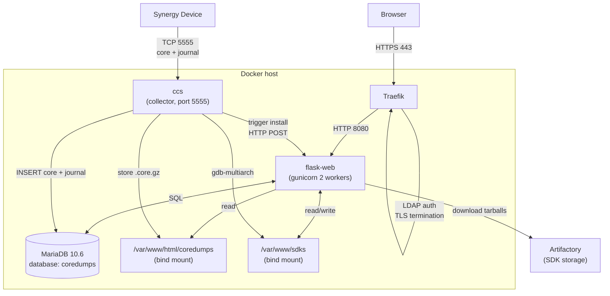
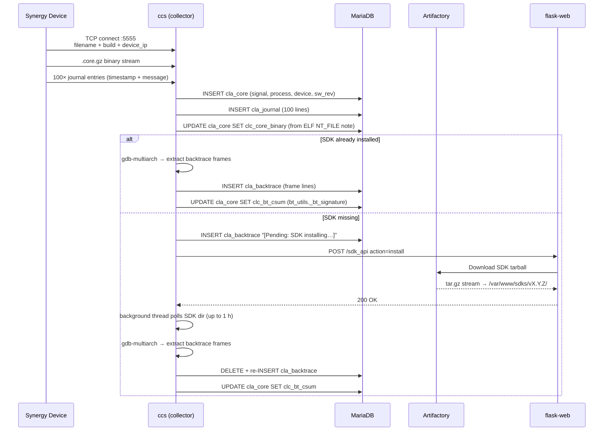
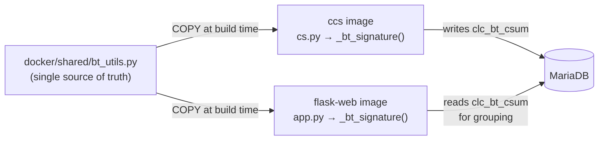

# synergy-coredump-web

## Description

synergy-coredump-web is a web service for browsing, analysing, and triaging
coredumps collected from Synergy devices.

The application is written in Python (Flask + gunicorn) and backed by MariaDB.
Traefik runs in front as a reverse proxy, handling LDAP authentication and
HTTPS termination.

## Overview

1. [CONTRIBUTING.md](./CONTRIBUTING.md)
2. [LICENSE](./LICENSE)
3. [DOCUMENTATION](./docs)

## Features

| Page | URL | Description |
|------|-----|-------------|
| Dashboard | `/` | Stats, top crashing binaries (with crash cause classification), crashes per device, recent coredumps, SDK status |
| Coredumps | `/cores` | Filterable list — SW revision, signal, device, binary (dropdown), BT checksum, process |
| Core detail | `/cores/<id>` | Metadata, backtrace (with copy button), journal, related crashes, ticket marking, GitHub issue creation, SDK install |
| Devices | `/devices` | All known devices with crash counts |
| Device detail | `/devices/<id>` | Per-device coredump list |
| SW Revisions | `/revisions` | All SW revisions with crash counts and SDK install status |
| Crash Analysis | `/analyze` | Per-binary/process crash grouping by backtrace signature — systematic bug detection, cause badges, ticket marks |

### Key features

- **Ticket / Mark-as-analyzed** — mark any crash signature with a GitHub issue
  number. The mark propagates across all pages (dashboard, cores, analyze)
  based on backtrace checksum.
- **Create GitHub Issue** — pre-fills title and full markdown body (process,
  signal, device, SW rev, backtrace) in GitHub `issues/new`. After opening,
  an inline prompt lets you enter the new issue number and mark the crash
  immediately.
- **Crash cause classification** — automatically detects Watchdog Timeout, OOM
  Kill, Stack Smash, Bus Error, and Segfault from journal lines.
- **Systematic bug detection** — flags crash signatures seen on more than one
  device.
- **SDK management** — install/cancel Artifactory SDK downloads per revision,
  used by the collector to generate backtraces. Auto-install runs at midnight
  and on reboot via cron.
- **Coredump download** — direct download of `.core.gz` files with path
  traversal protection.

## Development

### Local testing (Flask + MariaDB, no Traefik/LDAP)

A lightweight override (`docker-compose-local.yml`) exposes Flask directly on
port **8080** and stores all data under `./data/` inside the repo.

#### Prerequisites

- Docker with Compose plugin (`docker compose version`)
- No other service bound to port `8080`

#### First-time setup

```bash
mkdir -p data/coredumps data/mariadb data/sdks
```

#### Start the stack

```bash
docker compose -f docker-compose.yml -f docker-compose-local.yml up -d mariadb flask-web ccs
```

MariaDB initialises its schema automatically from `docker/ccs/sql/` on first
start (when `./data/mariadb/` is empty). Wait ~5 seconds, then open:

```
http://localhost:8080/
```

#### Rebuild after code changes

```bash
docker compose -f docker-compose.yml -f docker-compose-local.yml build flask-web \
  && docker compose -f docker-compose.yml -f docker-compose-local.yml up -d --force-recreate flask-web
```

#### Stop the stack

```bash
docker compose -f docker-compose.yml -f docker-compose-local.yml down
```

> **Note:** `docker-compose-local.yml` and `./data/` are for local development
> only and must **not** be used on the production server.

### Development override (with Traefik + hot-reload)

```bash
docker compose -f docker-compose.yml -f docker-compose-dev.yml up --build
```

Requires local TLS certificates:

```bash
mkcert -key-file $PWD/certs/localhost.key -cert-file $PWD/certs/localhost.crt localhost 127.0.0.1 ::1
```

Endpoint: `https://coredumps.localhost`

### Running tests

```bash
/path/to/.venv/bin/pytest web/tests/ -v
```

Tests cover `ticket_api` validation, mark/unmark, `_github_url`, `badge_color`,
and `_fetch_tickets` error handling. No real DB or network required — all DB
calls are mocked. `test_app.py` adds `docker/shared/` to `sys.path` so that
`bt_utils` is importable without installing it.

## Deployment

Deployment is automated via GitHub Actions on push to `main`
(see `.github/workflows/deploy-production.yml`). The workflow:

1. Stops the existing compose stack (`docker compose down`)
2. Rsyncs the repo to `~/coredump-server/` on the runner
3. Runs `docker compose -f docker-compose.yml -f docker-compose-production.yml up -d --build --force-recreate`

### First-time production DB migration

MariaDB init scripts only run when the data directory is empty. On an existing
production DB, run once:

```bash
docker exec coredump-server-mariadb-1 mariadb -u root coredumps -e "
CREATE TABLE IF NOT EXISTS \`cla_ticket\` (
  \`clt_id\` int(11) NOT NULL AUTO_INCREMENT,
  \`clt_bt_csum\` varchar(64) NOT NULL,
  \`clt_issue\` varchar(32) NOT NULL,
  \`clt_note\` varchar(255) DEFAULT NULL,
  \`clt_created_at\` datetime DEFAULT CURRENT_TIMESTAMP,
  PRIMARY KEY (\`clt_id\`),
  UNIQUE KEY \`clt_csum_unique\` (\`clt_bt_csum\`)
) ENGINE=InnoDB DEFAULT CHARSET=utf8mb4 COLLATE=utf8mb4_general_ci;
GRANT INSERT, UPDATE, DELETE ON coredumps.cla_ticket TO 'apache'@'%';
FLUSH PRIVILEGES;
"
```

Both statements are idempotent and safe to re-run.

## Architecture

### System overview



- **Flask** (gunicorn, 2 workers) listens on port `8080` internally
- **MariaDB 10.6** — database `coredumps`, `apache` user has `SELECT` on all
  tables plus `INSERT/UPDATE/DELETE` on `cla_ticket`
- **ccs** — coredump collector service (port `5555`)
- All secrets (LDAP bind, Artifactory credentials, TLS key) are injected via
  environment variables and Docker secrets

### Coredump ingestion pipeline



### Shared code (`docker/shared/`)

`docker/shared/bt_utils.py` is the single source of truth for backtrace
normalisation and signature hashing. Both `ccs` (ingest time) and `flask-web`
(query/display time) copy this file into their images at build time, ensuring
the `clc_bt_csum` stored in the DB is always computed with the same algorithm.



| Export | Purpose |
|--------|---------|
| `_normalize_bt_line(line)` | Strip hex addresses, `<...>` values, `=N` params |
| `_is_abort_frame(line)` | Detect signal/abort boilerplate frames |
| `_strip_leading_abort_frames(lines)` | Remove leading abort frames before hashing |
| `_bt_signature(lines, max_frames=4)` | MD5 of top 4 normalised non-abort frames |

### Build context

The `ccs` service uses the repo root as its Docker build context (instead of
`docker/ccs/`) so that both `docker/ccs/` and `docker/shared/` are accessible
in the same build. A `.dockerignore` at the repo root excludes `data/` to
prevent permission-denied errors from Docker's build context scanner.

## Licenses

See [LICENSE](./LICENSE)
