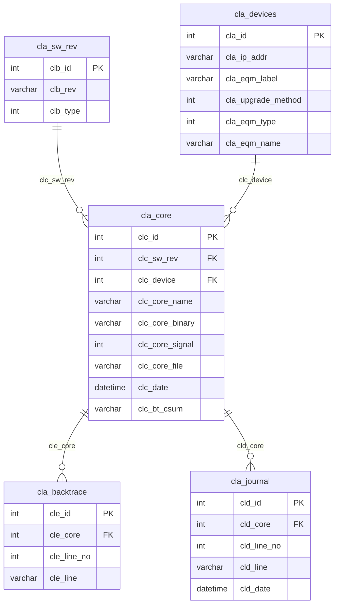

# Datenbank-Schema: coredumps

## ER-Diagramm

## Tabellen

| Tabelle | Beschreibung |
|---|---|
| `cla_sw_rev` | Software-Revisionen (Version und Typ) |
| `cla_devices` | Geraete (IP-Adresse, Label, Typ, Name) |
| `cla_core` | Coredump-Eintraege, verknuepft mit Software-Revision und Geraet |
| `cla_backtrace` | Backtrace-Zeilen zu einem Coredump |
| `cla_journal` | Journal-Eintraege zu einem Coredump |

## Beziehungen

- Ein **Geraet** (`cla_devices`) kann mehrere **Coredumps** (`cla_core`) haben.
- Eine **Software-Revision** (`cla_sw_rev`) kann in mehreren **Coredumps** referenziert werden.
- Ein **Coredump** (`cla_core`) kann mehrere **Backtrace-Zeilen** (`cla_backtrace`) und **Journal-Eintraege** (`cla_journal`) haben.

## Benutzer

| Benutzer | Berechtigungen |
|---|---|
| `ccs` | Alle Rechte auf `coredumps.*` |
| `apache` | Nur Leserechte (`SELECT`) auf `coredumps.*` |